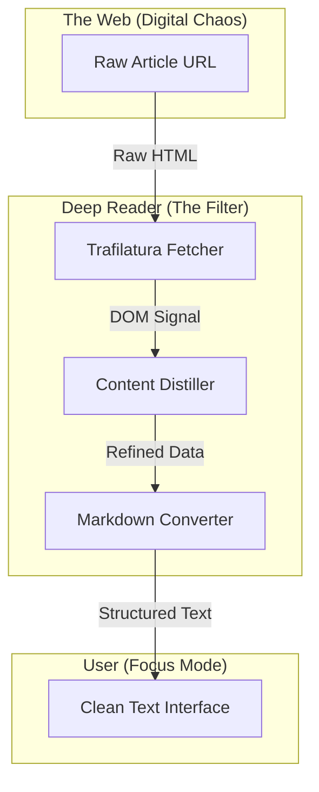

# Deep Reader: Anti-Slop Content Extractor

### **By George Freedom**

A minimalist, high-focus reading tool built with **Streamlit**, designed to strip away digital noise, advertisements, and "AI-slop" from web articles.

This project serves as a **Digital Hygiene** utility: capturing raw HTML from any URL, isolating the core intellectual signal using the **Trafilatura** engine, and rendering a clean, distraction-free Markdown interface.

It is a practical implementation of the **Rugged IT** philosophy—prioritizing information integrity and mental focus over modern web bloat.


### 📖 Live Reader HQ
Access the distraction-free reading environment directly through the web interface.

* **Live App:** [Deep Reader on Streamlit Cloud](#)

* **Core Mission:** This application implements a "Read-Only" protocol. It demonstrates how to bypass engagement-driven web design to reclaim focus and ensure data-driven consumption of information.


## 🚀 Key Features
* **Zero-Distraction Interface:** Complete removal of pop-ups, scripts, menus, and tracking pixels.

* **Markdown-First Rendering:** Converts complex web layouts into clean, structured Markdown for optimal legibility.

* **High-Efficiency Extraction:** Leverages the Trafilatura library for industry-leading precision in identifying main article text.

* **Metadata Integrity:** Automatically captures source URLs and timestamps to maintain a clean digital archive.

* **Mobile-Responsive Design:** Access your focused reading list from a laptop in the office or a phone on the go.


## ⚙️ System Architecture
The application follows a **Minimalist Modular Architecture**. By decoupling the extraction engine from the UI, the tool remains lightweight, resilient, and easily deployable on low-profile hardware like Raspberry Pi.

### 🌐 Signal Ingestion (The Interface)
* **URL Handshaking:** Securely fetching raw HTML data from remote servers.
* **Resilience Protocols:** Handling failed requests and script-heavy sites with graceful error signaling.

### 🧠 The Cleaning Engine (The Filter)
* **Content Distillation:** Identification of the primary text body while discarding structural noise (menus, ads, footers).
* **Format Conversion:** Transforming raw HTML into human-centric Markdown.

### 💻 Focus Workspace (The HQ)
* **Streamlit UI:** A centered, high-contrast interface designed for long-form reading.
* **Session Persistence:** Fast "Clear & Rerun" flow for processing multiple sources in sequence.


### System Diagram


## File Structure
```
deep-reader/
│
├── app.py                  # Main application & UI Orchestrator
├── requirements.txt        # Python dependencies (Streamlit, Trafilatura)
├── .gitignore              # Files ignored by Git
└── README.md               # This file
```

## 💡 Development Philosophy & AI Collaboration
This project was built using the "Human-Architect, AI-Builder" methodology, reflecting the core of the Builder Mindset.

**Human-led Strategy:** Defining the need for a "Digital Hygiene" tool to combat information overload and designing the minimalist UX.

**AI-assisted Implementation:** Leveraging AI to rapidly prototype the extraction logic and streamline the Streamlit UI components.

**Human-driven Refactoring:** Enforcing the "Cut the Fat" rule—removing unnecessary sidebars and complex CSS in favor of a lean, rugged script.

## ⚙️ Setup and running

1.  **Clone the Repository:**
    ```bash
    git clone [https://github.com/GeorgeFreedomTech/deep-reader.git](https://github.com/GeorgeFreedomTech/deep-reader.git)
    cd deep-reader
    ```
2.  **Create and Activate a Virtual Environment:**
    ```bash
    python -m venv venv
    # On Windows: venv\Scripts\activate
    # On macOS/Linux: source venv/bin/activate
    ```
3.  **Install Dependencies:**
    ```bash
    pip install -r requirements.txt
    ```
4.  **Configure Secrets:** Create a .streamlit folder and a secrets.toml file inside it:
    ```bash
    mkdir .streamlit
    # Create secrets.toml and add your API key:
    # METEOBLUE_API_KEY = "your_api_key_here"
    ```
5.  **Run the App:**
    ```bash
    streamlit run app.py
    ```

## 🔗 Let's Connect:

* Visit my website: **[https://GeorgeFreedom.com](https://GeorgeFreedom.com)**
* Connect on LinkedIn: **[https://www.linkedin.com/in/georgefreedom/](https://www.linkedin.com/in/georgefreedom/)**
* Let's talk: **[https://cal.com/georgefreedom](https://cal.com/georgefreedom)**


## 📜 License:

Copyright (c) 2025 Jiří Svoboda (George Freedom) / George Freedom Tech

This project is licensed under:
* Creative Commons Attribution-NonCommercial-ShareAlike 4.0 International License

---

We build for the Future!
